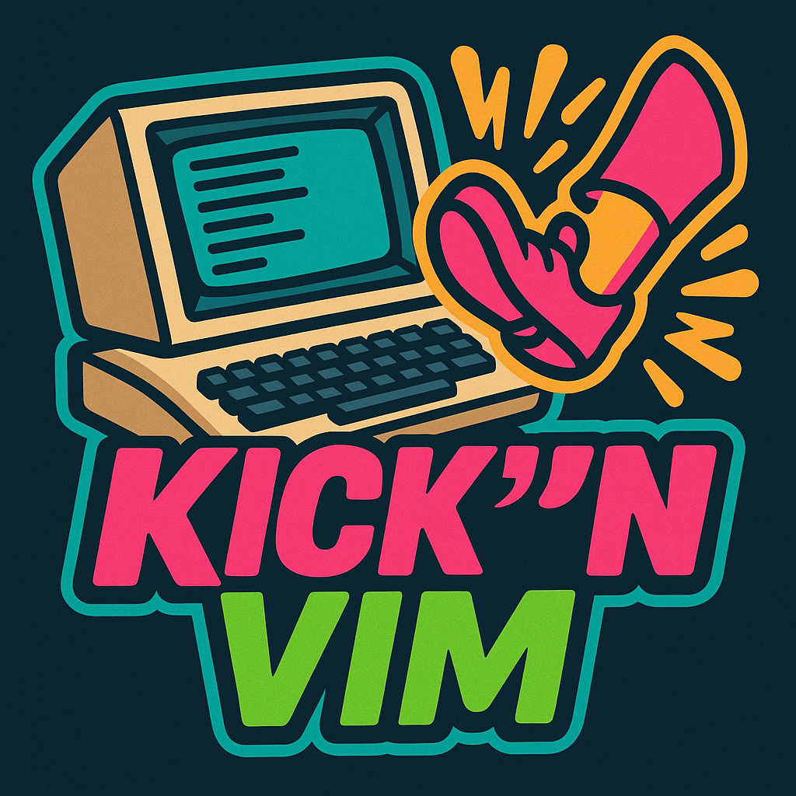

# Kick'N'Vim

> Assemble like it's 1985 – but with modern Neovim powers.

**Kick'N'Vim** is a Neovim plugin that gives you everything you need to write, build, and run [KickAssembler](http://theweb.dk/KickAssembler/) projects for the C64 – all from inside Neovim. If you’re tired of VSCode or other heavyweight environments and prefer fast, focused, keyboard-driven workflows, this one’s for you.

<p align="center">
  
</p>

---

## ✨ Features

* 🎨 Syntax highlighting for `_k.asm` files or by using `:set filetype=kickass`
* 🧠 Buffer-local keymaps for assembling and running code
* 🏃 Integration with [VICE](https://vice-emu.sourceforge.io/) to launch compiled `.prg` files
* 🚀 Complete 6502 assembler man pages included
* 🔧 Fully configurable with sane defaults
* 💥 Commands:

  * `:KickAssemble` → Assemble current file with KickAssembler
  * `:KickRun` → Launch compiled PRG in x64

---

## 🛠 Installation (Lazy.nvim)

```lua
{
  "IstiCusi/kicknvim",
  ft = "kickass",
  config = function()
    require("kicknvim").setup({
      kickass_path = "/home/phonon/opt/kickassembler/KickAss.jar", -- or "kickass" if using a wrapper
      kickman_man = false,
      x64_path = "/usr/bin/x64", -- path to your VICE binary
      keys = {
        assemble = "<leader>ka",
        run = "<leader>kr",
      },
    })
  end,
}
```

The plugin will only activate for buffers with `filetype=kickass`.

---

## ⚙ Configuration Options

| Option         | Description                                  | Default                    |
| -------------- | -------------------------------------------- | -------------------------- |
| `kickass_path` | Path to `KickAss.jar` or a wrapper script    | `"kickass"`                |
| `x64_path`     | Path to your VICE emulator binary (x64)      | `"x64"`                    |
| `keys`         | Table with `assemble` and `run` key mappings | `<leader>ka`, `<leader>kr` |
| `kickass_man`  | Installation or Deinstallation of man pages  | `false`                    |

You can redefine keybindings, use your own emulator, or point to another version of KickAssembler if needed.

---

## 🚀 Usage

1. Open your `.asm` file. Make sure it triggers the filetype `kickass`.
2. Press `<leader>ka` to assemble it using KickAssembler.
3. Press `<leader>kr` to run the output `.prg` in VICE (x64).

---

## 🔎 Requirements

* [KickAssembler 5.25](http://theweb.dk/KickAssembler/) (this version assumed as baseline)
* Java (for running KickAss.jar)
* [VICE emulator](https://vice-emu.sourceforge.io/) with `x64` in your PATH or specified manually

---

## 🛍 Roadmap

We’re just getting started. Planned features:

* 🧠 C64 memory layout visualization (zero page, heap, ROM/RAM boundaries)
* 🎯 In-editor breakpoints without `.break` pseudo-op (via integration)
* 🧵 Embedded VICE debugger (bidirectional communication with VICE)
* 🛠 Project templating and helpers for BASIC loaders, IRQ setup, and more
* 💬 Output preview for compiler errors and warnings in a floating window

---

## 🙏 Credits

Huge thanks to:

* **Jesper Gravgaard**, creator of KickAssembler – one of the most powerful 6510 assemblers ever made.
* The **VICE team**, for keeping the C64 alive and emulated across decades.

Kick'N'Vim is just a humble bridge between these brilliant tools and the Neovim world.

---

## 👋 For Who?

If you:

* ❤️ Neovim
* 📂 Grew up with (or discovered) the C64
* 💥 Prefer fast, focused tooling over GUIs
* 🧱 Want full control over your assembly workflow

...then this plugin is for you.

---

Happy hacking – and remember: real coders `JSR $1000` instead of clicking buttons.

